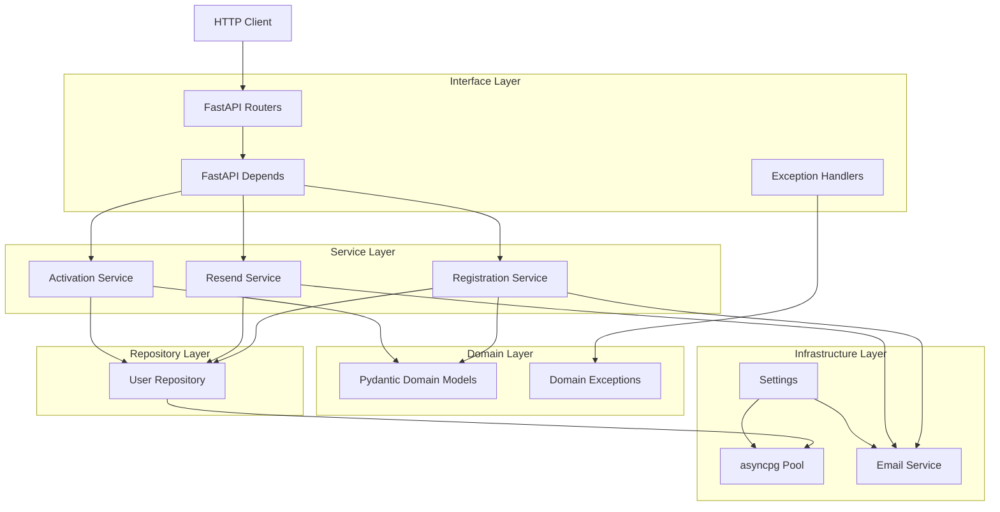
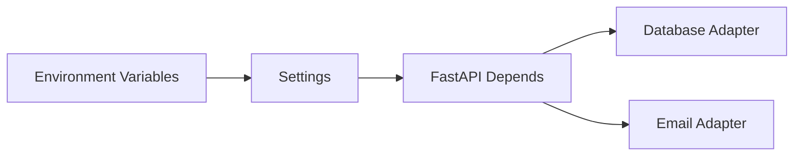

# Registration API Architecture

This document records the application shape as it is built incrementally. The
implementation follows a layered architecture: HTTP code translates requests,
services hold application use cases, repositories isolate SQL, and
infrastructure adapters own third-party concerns.

## Current System View

## Infrastructure Layer

The infrastructure layer currently contains:

- `registration.config.Settings`: all runtime configuration loaded through
  environment variables with `pydantic-settings`.
- `registration.infrastructure.database`: asyncpg pool creation and a lifespan
  context manager for startup/shutdown.
- `registration.infrastructure.email.EmailService`: an HTTP adapter for the
  third-party email service using `httpx` and bounded retries with `tenacity`.

The email adapter is deliberately isolated from services. Business code should
depend on a service/port abstraction in later phases, while this adapter owns
transport details such as URLs, timeouts, status handling, and retry policy.

## Configuration Flow

Settings are loaded once through `get_settings()` and then injected. This keeps
application code testable because tests can construct `Settings` directly or
override the dependency when the FastAPI app is added.

## Decisions

Detailed decision records live in `docs/decisions/`.
