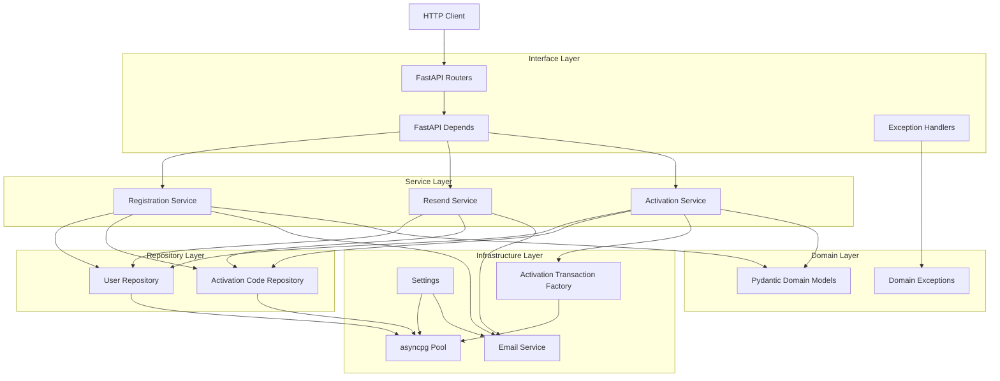
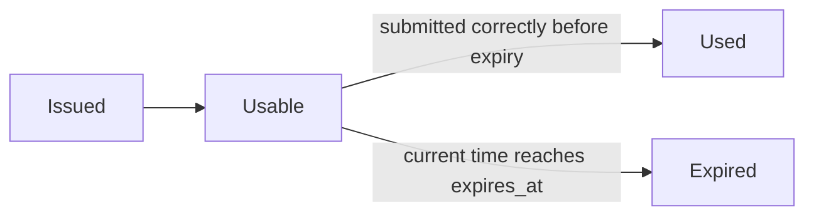
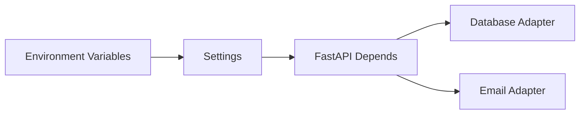

# Registration API Architecture

This document records the application shape as it is built incrementally. The
implementation follows a layered architecture: HTTP code translates requests,
services hold application use cases, repositories isolate SQL, and
infrastructure adapters own third-party concerns.

## Current System View

## Infrastructure Layer

The infrastructure layer contains:

- `registration.config.Settings`: all runtime configuration loaded through
  environment variables with `pydantic-settings`.
- `registration.infrastructure.database`: asyncpg pool creation and a lifespan
  context manager for startup/shutdown.
- `registration.infrastructure.email.EmailService`: an HTTP adapter for the
  third-party email service using `httpx` and bounded retries with `tenacity`.

The email adapter is deliberately isolated from services. Business code depends
on a service/port abstraction, while this adapter owns transport details such as
URLs, timeouts, status handling, and retry policy.

## Interface Layer

The HTTP interface layer contains:

- `registration.main`: FastAPI application factory and lifespan ownership for
  the asyncpg pool and email service.
- `registration.api.routes.users`: `/v1/users` registration, resend, and
  activation routes.
- `registration.api.dependencies`: FastAPI dependency wiring from process
  resources to repositories and services.
- `registration.api.exception_handlers`: domain exception to HTTP problem
  response mapping.

Route handlers stay transport-focused: validate request data, pass Basic Auth
credentials into services where required, and translate returned domain models
into response schemas.

## Domain Layer

The domain layer contains:

- `registration.domain.models.User`: an immutable Pydantic model for registered
  user accounts with a derived `status` property.
- `registration.domain.models.ActivationCode`: an immutable Pydantic model for
  issued activation codes, including code-format, timestamp, expiry, usage, and
  matching predicates.
- `registration.domain.exceptions`: anticipated workflow failures, grouped under
  `RegistrationError` for service-layer handling and HTTP exception mapping.

The models are intentionally small and behavior-focused. They encode invariants
that are true regardless of storage or transport, such as "active users have an
activation timestamp" and "activation codes expire after creation."

## Repository Layer

The repository layer contains:

- `registration.repositories.users.UserRepository`: raw SQL access for users and
  account state.
- `registration.repositories.activation_codes.ActivationCodeRepository`: raw SQL
  access for activation-code lifecycle operations.

Repositories map asyncpg rows into immutable domain models at the persistence
boundary. This keeps SQL details out of services while still avoiding an ORM.
Services instantiate repositories with either an asyncpg pool or a
transaction-bound connection. Activation uses repositories bound to the same
transaction while consuming a code and activating the user.

## Service Layer

The service layer contains:

- `registration.services.registration.RegistrationService`: hashes a password,
  creates a pending user, issues the first activation code, and requests email
  delivery.
- `registration.services.registration.ResendActivationCodeService`: verifies the
  user's Basic Auth credentials, enforces resend cooldown/attempt limits, and
  issues another activation code for pending users.
- `registration.services.activation.ActivationService`: verifies Basic Auth
  credentials, validates the latest unused activation code, marks the code as
  used, and activates the user inside one transaction.

Services depend on protocols rather than concrete repositories or email
adapters. This keeps application rules testable with fakes while allowing the
API layer to inject real asyncpg repositories and infrastructure adapters.

## Activation Code Lifecycle

## Configuration Flow

Settings are loaded through `get_settings()` and injected into dependency
factories. This keeps application code testable because tests can construct
`Settings` directly or override FastAPI dependencies.

## Decisions

Detailed decision records live in `docs/decisions/`.
